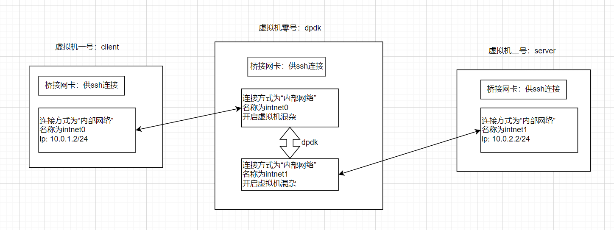
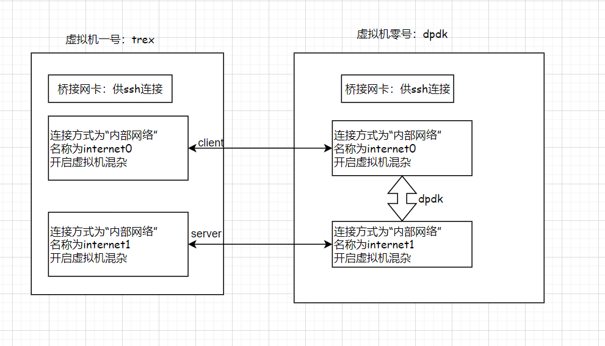

@[toc]
# 前言

下面，我通过多个虚拟机的方式，搭建dpdk的测试环境。

---

# 虚拟机的网络拓扑结构

## 网络拓扑结构
最朴素的想法是：一个客户端; 一个服务端; DPDK运行在网关/防火墙一类的产品上。所有的流量都使用DPDK进行转发。



上面可以，但是日常测试的时候会有点不方便。

我们需要一个流量生成工具。这里使用trex。它会使用一张网卡作为客户端，一张网卡作为服务端。可以省一台机器。也省了路由之类的配置。



每个虚拟机都有个桥接网卡，供外部ssh连接。

dpdk实验的时候，需要将两张网卡直接连接起来。这里使用 [virtualbox - Internal Networking](https://www.virtualbox.org/manual/ch06.html#network_internal) 来实现。

> Internal networks are created automatically as needed. There is no central configuration. Every internal network is identified simply by its name. Once there is more than one active virtual network card with the same internal network ID, the Oracle VM VirtualBox support driver will automatically *wire* the cards and act as a network switch. The Oracle VM VirtualBox support driver implements a complete Ethernet switch and supports both broadcast/multicast frames and promiscuous mode.

上面英文的大概意思是：internal netwok 是通过名称来区别。具有相同名称的网卡可以通信。这个通信是虚拟机之间的，不经过主机。VirtualBox 驱动程序将自动连接这些卡并充当网络交换机，支持广播/多播帧和混杂模式。

所以，上面的拓扑结构相当于，名称为intnet0的两张网卡插在一个交换机上。名称为intnet1的两张网卡插在另一个交换机上。而一个交换机上只接了两个网卡，相当于这两张网卡通过网桥连接，或者相当于通过网线直接连接。

virtualbox中配置内部网络的方式，如下图。


## 虚拟网卡的选择

总的来说，先随意选一种。demo程序出问题的时候，再选择合适的网卡。

### virtio driver

可以日常测试使用。但是它不支持 flow control。可见：[1. Overview of Networking Drivers — Data Plane Development Kit 24.11.0-rc0 documentation](https://doc.dpdk.org/guides/nics/overview.html)


### e1000 driver

使用的时候，留意到它只支持 2Tx, 2Rx queues。可见：[[E1000-devel] Does e1000e driver NOT need multiqueue?](https://e1000-devel.narkive.com/EXvuAoBW/does-e1000e-driver-not-need-multiqueue)

时间使用时，它的驱动是，`net_e1000_em` 。按理来说，e1000 是支持 flow control的。在虚拟机中测试的时候，不支持。要想知道具体原因，可能得看DPDK源码了。

### 不支持的虚拟网卡

- 8139[RTL8139D(L) - Realtek](https://www.realtek.com/Product/Index?id=488&cate_id=786)

---

# DPDK的机器的环境准备

## DPDK的编译

关于编译参数，自行参考官方手册和源码: [3. Compiling the DPDK Target from Source — Data Plane Development Kit 24.11.0-rc0 documentation](https://doc.dpdk.org/guides/linux_gsg/build_dpdk.html)

```
git clone git@github.com:DPDK/dpdk.git

git checkout v23.11

meson setup -Dcpu_instruction_set=corei7 -Dbuildtype=debug -Dexamples=all -Dprefix=YOUR_DPDK_INSTALL_PATH build
cd build
ninja 
# ninja install
```

## DPDK机器网卡绑定

ref: [7. Linux Drivers — Data Plane Development Kit 24.11.0-rc0 documentation](https://doc.dpdk.org/guides/linux_gsg/linux_drivers.html)

```bash
# 加载模块，这个模块可以让网卡被用户层程序接管
modprobe vfio-pci

# 查看网卡状态
./usertools/dpdk-devbind.py --status

Network devices using kernel driver
===================================
0000:00:12.0 'Virtio network device 1000' if=ens18 drv=virtio-pci unused=vfio-pci *Active*
0000:00:13.0 'Virtio network device 1000' if=ens19 drv=virtio-pci unused=vfio-pci *Active*
0000:00:14.0 'Virtio network device 1000' if=ens20 drv=virtio-pci unused=vfio-pci *Active*
0000:00:15.0 'Virtio network device 1000' if=ens21 drv=virtio-pci unused=vfio-pci *Active*
0000:00:16.0 'Virtio network device 1000' if=ens22 drv=virtio-pci unused=vfio-pci *Active*

# 这里我们将使用 ens21,ens22

# 停止网卡
# ip link set ens21 down
# ip link set ens22 down

# 绑定网卡
## 这个python在dpdk源码中
./usertools/dpdk-devbind.py --bind=vfio-pci ens21
./usertools/dpdk-devbind.py --bind=vfio-pci ens22

# 绑定网卡时的报错信息处理
Error: bind failed for 0000:00:16.0 - Cannot bind to driver vfio-pci: [Errno 22] Invalid argument
Error: unbind failed for 0000:00:16.0 - Cannot open /sys/bus/pci/drivers//unbind: [Errno 13] Permission denied: '/sys/bus/pci/drivers//unbind'

## 处理方式
## https://stackoverflow.com/questions/75840973/dpdk20-11-3-cannot-bind-device-to-vfio-pci
echo 1 > /sys/module/vfio/parameters/enable_unsafe_noiommu_mode
```

## 大页设置

第一种是我喜欢用的，使用DPDK中的[dpdk-hugepages.py](https://github.com/DPDK/dpdk/blob/main/usertools/dpdk-hugepages.py)。

```shell
# 查看当前系统的大页情况
./usertools/dpdk-hugepages.py -s

# 创建挂载点
# sudo  mkdir -p  /dev/hugepages

# 创建大页。每个页面2M,总共创建1G大页
./usertools/dpdk-hugepages.py -p 2048K --setup 1G
```

第二种是，设置启动参数：[linux大页内存使用,教你如何解决DPDK内存大页在NUMA架构重分配问题](https://blog.csdn.net/weixin_39876877/article/details/116626439)
> default_hugepagesz=1G hugepagesz=1G hugepages=1设置到/etc/default/grub中的GRUB_CMDLINE_LINUX中，然后运行update-grub更新启动参数配置文件 /boot/grub/grub.cfg。之后重新启动，cat /proc/meminfo就能看到系统中显示大页数量和剩余的数量(这个图是配置的2M的页)。

## DPDK的机器运行基本的转发程序

下面，我们先启动转发程序。

```bash
gdb ./dpdk-skeleton  
EAL: Detected CPU lcores: 8
EAL: Detected NUMA nodes: 1
EAL: Detected static linkage of DPDK
EAL: Multi-process socket /var/run/dpdk/rte/mp_socket
EAL: Selected IOVA mode 'PA'
EAL: Probe PCI driver: net_e1000_em (8086:100e) device: 0000:00:08.0 (socket -1)
EAL: Probe PCI driver: net_e1000_em (8086:100e) device: 0000:00:09.0 (socket -1)
TELEMETRY: No legacy callbacks, legacy socket not created
Port 0 MAC: 08 00 27 7c bf 6e
Port 1 MAC: 08 00 27 af 8d 7d

WARNING: Too many lcores enabled. Only 1 used.

Core 0 forwarding packets. [Ctrl+C to quit]
```

# trex的机器生成流量

trex官方文档见：[trex](https://trex-tgn.cisco.com/)

首先是下载trex。

```shell
# 下载trex
mkdir trex && cd trex
# wget --no-cache https://trex-tgn.cisco.com/trex/release/latest --no-check-certificate
wget --no-cache https://trex-tgn.cisco.com/trex/release/latest
tar -zxvf latest
cd v3.06 #当前版本

# 无需手动绑定端口，运行trex的时候，会自动绑定
## 查看端口
./dpdk_setup_ports.py -s
Network devices using DPDK-compatible driver
============================================
<none>

Network devices using kernel driver
===================================
0000:00:03.0 '82540EM Gigabit Ethernet Controller' if=enp0s3 drv=e1000 unused=igb_uio,vfio-pci,uio_pci_generic *Active*
0000:00:08.0 '82540EM Gigabit Ethernet Controller' if=enp0s8 drv=e1000 unused=igb_uio,vfio-pci,uio_pci_generic 
0000:00:09.0 '82540EM Gigabit Ethernet Controller' if=enp0s9 drv=e1000 unused=igb_uio,vfio-pci,uio_pci_generic 
```

然后设置trex程序的运行配置。即，使用哪些网卡进行流量发送。

```yml
# 保存为/etc/trex_cfg.yaml
- port_limit      : 2         # this option can limit the number of port of the platform
  version         : 2
  interfaces      : ["00:15.0","00:16.0"]
  low_end         : true # 在笔记本上的虚拟机上跑的，性能比较低，加上这个选项。
  port_info       :  # Port IPs. Change according to your needs. In case of loopback, you can leave as is.
          - ip         : 1.1.1.1 # port 0的ip;  
            default_gw : 2.2.2.2 # port 0的默认网关
          - ip         : 2.2.2.2 # port 1的ip和gw配置。和port 0相反
            default_gw : 1.1.1.1
```

运行trex。还有其他emample，见：[trex run example](https://trex-tgn.cisco.com/trex/doc/trex_manual.html#_running_examples)。

```shell
# -c 1 使用一个核; -m 1 倍率; -d 20 持续20秒
./t-rex-64 -f cap2/dns.yaml -c 1 -m 1 -d 20
```

上面这个命令的效果是，使用dns.pcapng文件作为模板，client_ip/server_ip随机生成进行替换。

```yaml
# cap2/dns.yaml
- duration : 10.0
  generator :  
          distribution : "seq"
          clients_start : "16.0.0.1"
          clients_end   : "16.0.1.255"
          servers_start : "48.0.0.1"
          servers_end   : "48.0.0.255"
          clients_per_gb : 201
          min_clients    : 101
          dual_port_mask : "1.0.0.0" 
          tcp_aging      : 1
          udp_aging      : 1
  cap_info : 
     - name: cap2/dns.pcap
       cps : 1.0 #每秒一个链接
       ipg : 10000 # 没10ms发一个包
       rtt : 10000
       w   : 1

```

运行结果。

```shell
port : 0 
------------
 opackets                                 : 19 
 obytes                                   : 1463 
 ipackets                                 : 19 
 ibytes                                   : 1767 
 Tx :     306.10  bps  
port : 1 
------------
 opackets                                 : 19 
 obytes                                   : 1767 
 ipackets                                 : 19 
 ibytes                                   : 1463 
 Tx :     369.71  bps  
 Cpu Utilization : 0.0  %
 Platform_factor : 1.0  
 Total-Tx        :     675.81  bps  
 Total-Rx        :     675.81  bps  
 Total-PPS       :       0.99  pps  
 Total-CPS       :       0.50  cps  

 Expected-PPS    :       2.00  pps  
 Expected-CPS    :       1.00  cps  
 Expected-BPS    :       1.36 Kbps  

 Active-flows    :        0  Clients :      511   Socket-util : 0.0000 %    
 Open-flows      :       19  Servers :      255   Socket :        0 Socket/Clients :  0.0 
 drop-rate       :       0.00  bps   
 summary stats 
 -------------- 
 Total-pkt-drop       : 0 pkts 
 Total-tx-bytes       : 3230 bytes 
 Total-tx-sw-bytes    : 0 bytes 
 Total-rx-bytes       : 3230 byte 
 
 Total-tx-pkt         : 38 pkts 
 Total-rx-pkt         : 38 pkts 
 Total-sw-tx-pkt      : 0 pkts 
 Total-sw-err         : 0 pkts 
 Total ARP sent       : 4 pkts 
 Total ARP received   : 4 pkts 
```