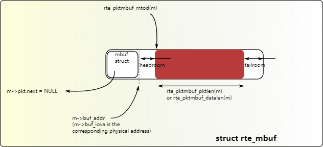
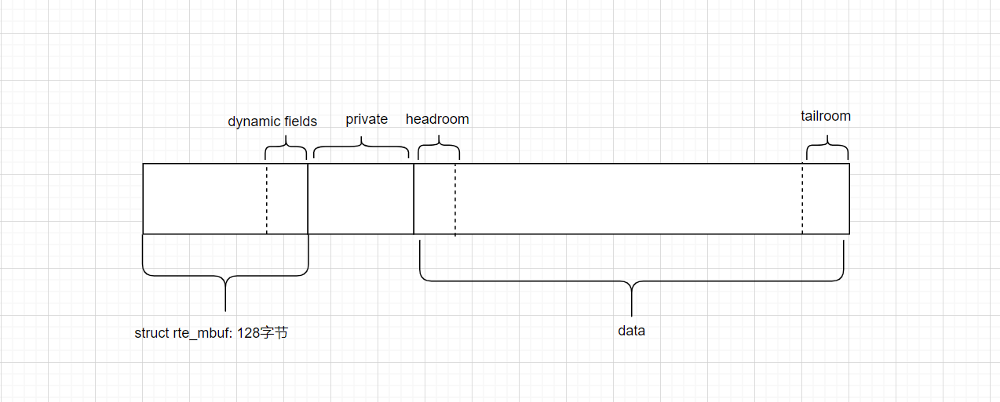

# dpdk RX/TX 回调

## 摘要

本文借助[rxtx_callbacks](https://github.com/DPDK/dpdk/blob/main/examples/rxtx_callbacks/main.c)示例程序，介绍mbuf的基本结构、端口的初始化、RX/TX回调函数。

## rte_mbuf的基本结构

相关链接：[14. Mbuf Library — Data Plane Development Kit 24.03.0-rc4 documentation](https://doc.dpdk.org/guides/prog_guide/mbuf_lib.html)

`rte_mbuf`中有很多字段。它是当前数据包的元数据。在内存中，它的大体结构如下。更详细的内容，请阅读上面链接。

我这里也补充一张图，对单个`rte_mbuf`结构做补充。

总的来说，相较于dynfield，我更喜欢private区域，因为它更大。当然，如果不需要给每个包附加很大空间的话，dynfield足够用的情况下，优先使用dynfield。

## 端口的初始化

* rte_eth_dev_configure: 设置一个端口输入/输出队列数，不知道的话，设置为0好了，程序会自动设置合适的数值。 rte_eth_conf中根据硬件信息，看是否配置offload和RSS, 这两个通过`rte_eth_dev_info_get`获取。
* rte_eth_dev_adjust_nb_rx_tx_desc：调整一个队列的描述符数可以是多少,它会自动调整到最大和最小值之间。
* rte_eth_rx_queue_setup/rte_eth_tx_queue_setup: 设置队列的大小(由上一步调节大小), 队列中存储的是描述符指针，指针指向pool。
  

## RX/TX回调函数

* rte_eth_add_rx_callback/rte_eth_add_tx_callback: 添加回调函数。

这两个函数作用不大。因为收到包后，可以挨个给每个包调用函数，不需要回调。

基本也不需要一个包那么精确的接收时间。而且如果是在多个numa上，使用 `rte_rdtsc()` 可能还有坑：[细说RDTSC的坑 – Dreamer Thinker Doer](http://www.wangkaixuan.tech/?p=901)。如果不是非常重要的地方，可以使用 `clock_gettime`函数。这个函数会拉低性能。我之前在dpdk中使用过这个函数，看了它调用的火焰图，凑活，能用。