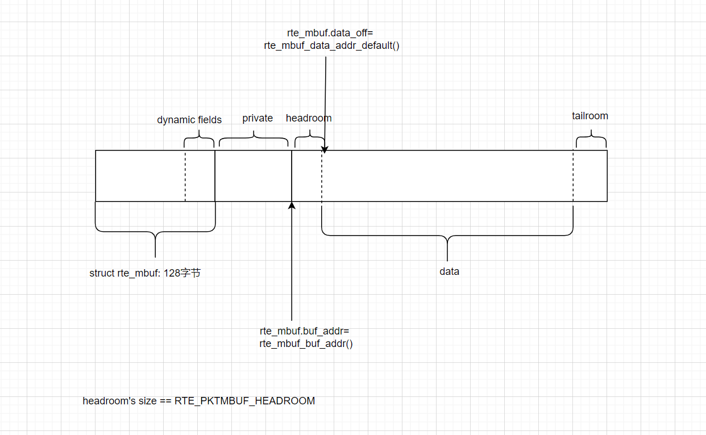

# dpdk RX/TX 回调

## 摘要

本文借助[rxtx_callbacks](https://github.com/DPDK/dpdk/blob/main/examples/rxtx_callbacks/main.c)示例程序，介绍mbuf的基本结构、端口的初始化、RX/TX回调函数。

## 前言

前置要求：
* [DPDK-Hello-World示例应用程序-CSDN博客](https://blog.csdn.net/sinat_38816924/article/details/134748238)、
* [dpdk二层转发环境搭建-二-CSDN博客](https://blog.csdn.net/sinat_38816924/article/details/136821484)

## rte_mbuf的基本结构

相关链接：[14. Mbuf Library — Data Plane Development Kit 24.03.0-rc4 documentation](https://doc.dpdk.org/guides/prog_guide/mbuf_lib.html)

`rte_mbuf`中有很多字段。它是当前数据包的元数据。在内存中，它的大体结构如下。更详细的内容，请阅读上面链接。

我这里也补充一张图，对单个`rte_mbuf`结构做补充。

总的来说，相较于dynfield，我更喜欢private区域，因为它更大。当然，如果不需要给每个包附加很大空间的话，dynfield足够用的情况下，优先使用dynfield。

## 端口的初始化

* rte_eth_dev_configure: 设置一个端口输入/输出队列数，不知道的话，设置为0好了，程序会自动设置合适的数值。 rte_eth_conf中根据硬件信息，看是否配置offload和RSS, 这两个通过`rte_eth_dev_info_get`获取(这两个，我目前都没有感触)。
* rte_eth_dev_adjust_nb_rx_tx_desc：调整一个队列的描述符数可以是多少,它会自动调整到最大和最小值之间。
* rte_eth_rx_queue_setup/rte_eth_tx_queue_setup: 设置队列的大小(由上一步调节大小), 队列中存储的是描述符指针，指针指向pool。
  

## RX/TX回调函数

* rte_eth_add_rx_callback/rte_eth_add_tx_callback: 添加回调函数。

这两个函数作用不大。因为收到包后，可以挨个给每个包调用函数，不需要回调。

基本也不需要一个包那么精确的接收时间。