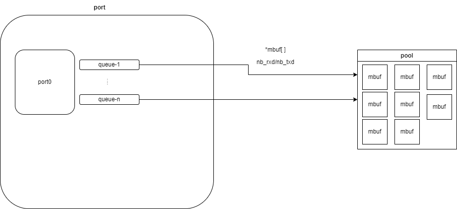

[toc]

# dpdk网络转发环境的搭建

## 前言

注：本文验证网络转发的代码来自[dpdk/examples/skeleton at main · DPDK/dpdk](https://github.com/DPDK/dpdk/tree/main/examples/skeleton)。我将它移动到该仓库目录中。

相关文档：[Basic Forwarding Sample Application — Data Plane Development Kit 23.11.0 documentation](https://doc.dpdk.org/guides/sample_app_ug/skeleton.html)

## dpdk-basicfwd代码分析

200行的代码，很快就能看完一遍。具体的API使用见官方文档，这里简述下流程。

首先是内存池和cpu相关的初始化，这个和存储架构相关。大体知道知道这些含义即可：NUMA node > socket > core > logical processor。相关内容见：[CPU 拓扑：从 SMP 谈到 NUMA （理论篇） | 猿大白](https://ctimbai.github.io/2018/05/10/tech/linux/cpu/CPU%E6%8B%93%E6%89%91%EF%BC%9A%E4%BB%8ESMP%E8%B0%88%E5%88%B0NUMA%EF%BC%88%E5%AE%9E%E8%B7%B5%E7%AF%87%EF%BC%89/)

接着是端口相关的初始化，简单的基本流程是：查看当前端口的信息->对端口进行配置->调整接收-发送描述符数->创建接收和发送队列，队列是一个连续的内存块，它的大小是描述符的个数。这部分的结构**可能**是这样的。

然后就是转发。从一个端口接收到数据，然后让另一个端口发送这部分数据。

